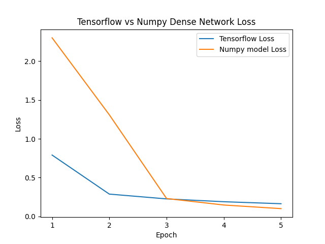

# image-number-classification-with-neural-networks
This is my first ever project with neural networks, in which I am implementing a rather simple image recognition algorithm for the MNIST database. My goal here is mostly to explore dense and convolutional neural networks and their inner workings. 

In the src folder, there are files for networks created with the tensorflow library, as well as implementations from scratch with numpy.

